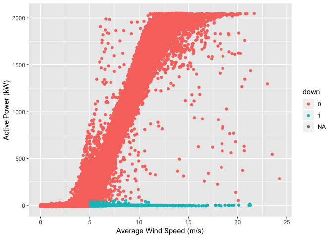

I will load some libraries that I will use for exploring the data, and for cleaning it.

```r
library(readr)
library(dplyr)
```

```
## 
## Attaching package: 'dplyr'
```

```
## The following objects are masked from 'package:stats':
## 
##     filter, lag
```

```
## The following objects are masked from 'package:base':
## 
##     intersect, setdiff, setequal, union
```

```r
library(tidyr)
library(ggplot2)
library(data.table)
```

```
## 
## Attaching package: 'data.table'
```

```
## The following objects are masked from 'package:dplyr':
## 
##     between, first, last
```
##Read data and cleaning
Read data for full Haute Born Wind farm from 2017 to 2020, and the data description file or metadata using the fread() function with data.table = FALSE:


```r
haute_all_2017_2020 <- fread("la-haute-borne-data-2017-2020.csv", data.table = FALSE)
data_description <- fread("data_description.csv")
```

Make tibble of data:


```r
haute <- tbl_df(haute_all_2017_2020)
metadata <- tbl_df(data_description)
```

Make a list of old names and one of replacement names from metadata:


```r
old <- metadata[,"Variable_name"]
new <- metadata[, "Variable_long_name"]
```

Create a function to replace old names with a corresponding longer name on the new names list:


```r
fast_clean <- function(df, x) {colnames(df) <- gsub (old[[c(1, x)]], new[[c(1, x)]], colnames(df)) ; df}
```

Apply the fast_clean function first to two column names that would create distortions in a while loop


```r
haute<- fast_clean(haute, 20)
haute<- fast_clean(haute, 27)
```

Use a while loop to take the old part of each column name and replace it by increments, skipping variable 20 and 27, which I have already done in the previous code chunk.


```r
n <- 1
while(n < 20) {haute <- fast_clean(df = haute, x = n)
  n <- (n + 1)
  }
n <- 21
while(n < 27) {haute <- fast_clean(df = haute, x = n)
  n <- (n + 1)
  }
n <- 28
while(n <= 34) {haute <- fast_clean(df = haute, x = n)
  n <- (n + 1)
  }
```

Separate date and time in the datetime column. 


```r
haute <- separate(haute, "Date_time", c("date", "time"), sep = "T", remove = TRUE, convert = FALSE, extra = "warn", fill = "warn")
```

Make Date into date format.


```r
haute$date <- as.Date(haute$date, "%Y-%m-%d")
```

The code is ready for some meaningful exploration. See "Exploratory Plots.rmd" .


##Feature Engineering and Machine Learning

In the exploration phase of the project, I decided to look at instances of turbines not functioning as intended. This wil require first some feature engineering. I will create a new feature "down" that displays a 1 if the wind speed is above 5 m/s but average active power is below 50 kW.


```r
down <- ifelse(haute$Wind_speed_avg > 5 & haute$Active_power_avg < 50, 1, 0)
summary(down)
```

```
##    Min. 1st Qu.  Median    Mean 3rd Qu.    Max.    NA's 
##  0.0000  0.0000  0.0000  0.0115  0.0000  1.0000    1658
```

```r
haute$down <- as.factor(down)
class(haute$down)
```

```
## [1] "factor"
```

I want to make a smaller data frame of only the average reading for each entry, this will remove a large amount of the data. I will call this haute_avgs and remove the turbine ID, date, and Time but include the new binary feature, "down"


```r
down <- haute$down
haute_avgs <- select(haute, contains("avg"))
haute_avgs <- select(haute_avgs, -c(1,2,3))
haute_avgs <- cbind(haute_avgs, down)
head(haute_avgs)
```

```
##   Converter_torque_avg Active_power_avg Reactive_power_avg
## 1              2446.26           340.32               5.70
## 2              4352.12           790.67               0.01
## 3               698.13            41.39              27.64
## 4                -8.51            -0.20               0.00
## 5              3172.65           522.72               2.29
## 6              3228.66           532.29              -4.34
##   Apparent_power_avg Power_factor_avg Generator_speed_avg
## 1             340.43             1.00             1404.06
## 2             790.71             1.00             1734.21
## 3              52.95             0.99              972.25
## 4               0.20             1.00              129.30
## 5             522.82             1.00             1589.18
## 6             532.33             1.00             1610.05
##   Generator_bearing_1_temperature_avg Generator_bearing_2_temperature_avg
## 1                               36.21                               29.75
## 2                               33.08                               33.15
## 3                               42.93                               38.26
## 4                               32.38                               33.61
## 5                               46.56                               39.08
## 6                               43.42                               34.04
##   Generator_stator_temperature_avg Gearbox_bearing_1_temperature_avg
## 1                            53.21                             63.19
## 2                            54.58                             69.10
## 3                            64.15                             53.59
## 4                            53.77                             43.60
## 5                            63.63                             66.68
## 6                            59.36                             68.33
##   Gearbox_bearing_2_temperature_avg Gearbox_inlet_temperature_avg
## 1                             64.95                         55.44
## 2                             71.68                         53.71
## 3                             50.44                         46.11
## 4                             43.60                         43.37
## 5                             69.64                         51.03
## 6                             71.03                         53.54
##   Gearbox_oil_sump_temperature_avg Nacelle_angle_avg
## 1                            56.87             75.73
## 2                            59.02            248.05
## 3                            46.53            302.93
## 4                            44.22            302.93
## 5                            58.11            243.66
## 6                            58.70             81.22
##   Nacelle_temperature_avg Wind_speed1_avg Wind_speed_2_avg Wind_speed_avg
## 1                   19.51            5.54             6.14           5.84
## 2                   20.89            7.97             7.56           7.76
## 3                   24.12            3.97             4.07           4.02
## 4                   14.27            2.69             3.00           2.84
## 5                   19.23            7.04             6.59           6.82
## 6                   22.28            6.58             6.58           6.58
##   Absolute_wind_direction_avg Vane_position1_avg Vane_position2_avg
## 1                       70.19                 NA                 NA
## 2                      248.02                 NA                 NA
## 3                      303.46                 NA                 NA
## 4                      319.95                 NA                 NA
## 5                      240.16                 NA                 NA
## 6                       81.63                 NA                 NA
##   Vane_position_avg Outdoor_temperature_avg Grid_frequency_avg
## 1             -5.55                   -1.12              50.01
## 2              0.02                    9.31              50.01
## 3              0.58                    5.26              49.99
## 4             17.04                    4.89              50.00
## 5             -3.52                    9.49              50.00
## 6              0.41                   -2.22              50.03
##   Grid_voltage_avg Rotor_speed_avg Rotor_bearing_temperature_avg
## 1           704.62           13.38                         16.90
## 2           708.15           16.55                         27.21
## 3           699.85            9.25                         19.32
## 4           698.90            1.23                         18.01
## 5           707.06           15.16                         26.40
## 6           700.41           15.36                         19.70
##   Torque_avg Active_poweras_avg Absolute_wind_direction_corrected_avg
## 1    2288.60                 NA                                    NA
## 2    4306.86                 NA                                248.02
## 3     405.55                 NA                                303.46
## 4     -14.90                 NA                                319.95
## 5    3065.34                 NA                                240.16
## 6    3148.24                 NA                                    NA
##   Nacelle_angle_corrected_avg down
## 1                          NA    0
## 2                      248.02    0
## 3                      303.46    0
## 4                      319.95    0
## 5                      240.16    0
## 6                          NA    0
```

I will view the number of missing values in each column.


```r
missing.values <- haute_avgs %>%
  gather(key = "key", value = "val") %>%
  mutate(is.missing = is.na(val)) %>%
  group_by(key, is.missing) %>%
  summarise(num.missing = n()) %>%
  filter(is.missing==T) %>%
  select(-is.missing) %>%
  arrange(desc(num.missing)) 
```

```
## Warning: attributes are not identical across measure variables;
## they will be dropped
```

```r
missing.values
```

```
## # A tibble: 32 x 2
## # Groups:   key [32]
##    key                                   num.missing
##    <chr>                                       <int>
##  1 Active_poweras_avg                         217588
##  2 Absolute_wind_direction_corrected_avg      183657
##  3 Nacelle_angle_corrected_avg                183657
##  4 Vane_position_avg                          140456
##  5 Vane_position1_avg                          79081
##  6 Vane_position2_avg                          79081
##  7 Torque_avg                                   5290
##  8 Reactive_power_avg                           5108
##  9 Rotor_speed_avg                              4576
## 10 Generator_speed_avg                          3027
## # … with 22 more rows
```

I will remove 6 columns from the dataset with the most NAs (over 6000 missing values). How many missing values is too many? This could be a place for further experimentation to improve a machine learning model.


```r
haute_avgs <- select(haute_avgs, -contains("Active_poweras_avg"))
haute_avgs <- select(haute_avgs, -contains("Absolute_wind_direction_corrected_avg"))
haute_avgs <- select(haute_avgs, -contains("Nacelle_angle_corrected_avg"))
haute_avgs <- select(haute_avgs, -contains("Vane_position1_avg"))
haute_avgs <- select(haute_avgs, -contains("Vane_position2_avg"))
haute_avgs <- select(haute_avgs, -contains("Vane_position_avg"))
```

Do I need to remove wind speed and active power, the two variables which determine the feature "down"? For now, I will do so.


```r
haute_avgs <- select(haute_avgs, -contains("Active_power_avg"))
haute_avgs <- select(haute_avgs, -contains("Wind_speed_avg"))
```

Now haute_avgs is the working dataset. Lets check the balance. This will be important as the model used on the data will be logistic regression. This will also be considered the baseline prediction for negative cases. 


```r
table(haute_avgs$down)
```

```
## 
##      0      1 
## 213451   2479
```

```r
down_table <- table(haute_avgs$down)
down_table
```

```
## 
##      0      1 
## 213451   2479
```

```r
down_table[1]/(down_table[1] + down_table[2])
```

```
##         0 
## 0.9885194
```

A plot of this dataset with "down" mapped to color will highlight the cases I am interested in predicting.

```r
ggplot(haute, aes(x = Wind_speed_avg, y = Active_power_avg))+
  geom_point(aes(color = down)) +
  labs(x = "Average Wind Speed (m/s)", y = "Active Power (kW)")
```

```
## Warning: Removed 1658 rows containing missing values (geom_point).
```

<!-- -->

The positive cases of "down" is only about 1.2%. which means I will need to balance the data.
I will use the SMOTE function from the caret package which combines upsampling and downsampling. This gives a data set with 17,000 observations, and a balance of 75/25.


```r
library(caret)
```

```
## Loading required package: lattice
```

```r
library(DMwR)
```

```
## Loading required package: grid
```

```r
set.seed(2555)
smote_haute_avgs <- SMOTE(down ~ ., data = haute_avgs)
smoted_haute_avgs <- table(smote_haute_avgs$down)
smoted_haute_avgs[2]/smoted_haute_avgs[1]
```

```
##         1 
## 0.7553321
```

Now I want to create a logistic regression model based on this smaller subset of data.
I'll split the balanced data into a train and test set with split.seed from caTools.


```r
library(caTools)
set.seed(2555)
split <- sample.split(smote_haute_avgs$down, SplitRatio = .65)
train <- subset(smote_haute_avgs, split == TRUE)
test <- subset(smote_haute_avgs, split == FALSE)
table(train$down)
```

```
## 
##    0    1 
## 6400 4834
```

```r
table(test$down)
```

```
## 
##    0    1 
## 3446 2603
```

I will create a logistic regression model to predict "down" using the training set. 


```r
trainlogistic <- glm(down ~ ., data = train, family = binomial)
```

```
## Warning: glm.fit: fitted probabilities numerically 0 or 1 occurred
```

```r
summary(trainlogistic)
```

```
## 
## Call:
## glm(formula = down ~ ., family = binomial, data = train)
## 
## Deviance Residuals: 
##     Min       1Q   Median       3Q      Max  
## -3.7099   0.0000   0.0000   0.0001   2.5998  
## 
## Coefficients:
##                                       Estimate Std. Error z value Pr(>|z|)
## (Intercept)                         -2.896e+01  5.167e+00  -5.605 2.08e-08
## Converter_torque_avg                 1.627e-03  9.237e-04   1.761   0.0782
## Apparent_power_avg                  -2.693e-01  4.359e-02  -6.177 6.52e-10
## Power_factor_avg                    -2.639e+01  4.286e+00  -6.158 7.37e-10
## Generator_speed_avg                  3.983e-02  1.129e-01   0.353   0.7242
## Generator_bearing_1_temperature_avg  6.866e-01  1.474e-01   4.659 3.17e-06
## Generator_bearing_2_temperature_avg -2.179e-01  1.304e-01  -1.671   0.0948
## Generator_stator_temperature_avg    -5.207e-01  1.125e-01  -4.627 3.72e-06
## Gearbox_bearing_1_temperature_avg   -1.976e-02  1.772e-01  -0.112   0.9112
## Gearbox_bearing_2_temperature_avg    2.057e-01  2.536e-01   0.811   0.4174
## Gearbox_inlet_temperature_avg        1.448e-01  7.984e-02   1.813   0.0698
## Gearbox_oil_sump_temperature_avg     4.362e-02  1.438e-01   0.303   0.7616
## Nacelle_angle_avg                    1.642e-03  4.397e-03   0.373   0.7088
## Nacelle_temperature_avg             -1.019e-01  9.197e-02  -1.108   0.2677
## Wind_speed1_avg                      6.692e+00  7.683e-01   8.710  < 2e-16
## Wind_speed_2_avg                     2.127e+00  3.813e-01   5.578 2.44e-08
## Absolute_wind_direction_avg          6.861e-03  4.288e-03   1.600   0.1096
## Outdoor_temperature_avg             -1.536e-01  7.315e-02  -2.099   0.0358
## Grid_frequency_avg                  -1.457e-01  8.164e-01  -0.178   0.8584
## Grid_voltage_avg                     1.762e-02  5.832e-02   0.302   0.7626
## Rotor_speed_avg                     -3.589e+00  1.184e+01  -0.303   0.7618
## Rotor_bearing_temperature_avg        1.859e-01  1.159e-01   1.604   0.1087
## Torque_avg                          -2.085e-03  3.871e-03  -0.539   0.5901
##                                        
## (Intercept)                         ***
## Converter_torque_avg                .  
## Apparent_power_avg                  ***
## Power_factor_avg                    ***
## Generator_speed_avg                    
## Generator_bearing_1_temperature_avg ***
## Generator_bearing_2_temperature_avg .  
## Generator_stator_temperature_avg    ***
## Gearbox_bearing_1_temperature_avg      
## Gearbox_bearing_2_temperature_avg      
## Gearbox_inlet_temperature_avg       .  
## Gearbox_oil_sump_temperature_avg       
## Nacelle_angle_avg                      
## Nacelle_temperature_avg                
## Wind_speed1_avg                     ***
## Wind_speed_2_avg                    ***
## Absolute_wind_direction_avg            
## Outdoor_temperature_avg             *  
## Grid_frequency_avg                     
## Grid_voltage_avg                       
## Rotor_speed_avg                        
## Rotor_bearing_temperature_avg          
## Torque_avg                             
## ---
## Signif. codes:  0 '***' 0.001 '**' 0.01 '*' 0.05 '.' 0.1 ' ' 1
## 
## (Dispersion parameter for binomial family taken to be 1)
## 
##     Null deviance: 13543.19  on 10188  degrees of freedom
## Residual deviance:   157.21  on 10166  degrees of freedom
##   (1045 observations deleted due to missingness)
## AIC: 203.21
## 
## Number of Fisher Scoring iterations: 18
```

Now I will predict in the test set which turbines are down, using the logistic regression model I have just made, I will observe the confusion matrix resulting from a threshold of .5.


```r
predictTest <- predict(trainlogistic, type = "response", newdata = test)
table(test$down, predictTest > 0.5)
```

```
##    
##     FALSE TRUE
##   0  3376   10
##   1     9 2129
```

I will measure the performance of this model overall by measuring the area under the ROC curve.


```r
library(ROCR)
```

```
## Loading required package: gplots
```

```
## 
## Attaching package: 'gplots'
```

```
## The following object is masked from 'package:stats':
## 
##     lowess
```

```r
ROCRpred <- prediction(predictTest, test$down)
as.numeric(performance(ROCRpred, "auc")@y.values)
```

```
## [1] 0.9998413
```

The area under an ROC curve is .9998. As a measure of accuracy for this model, that is a minor improvement over the baseline of .9885.


