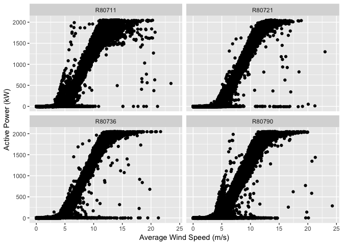
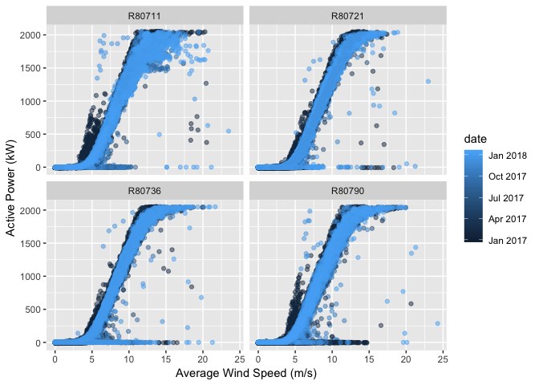
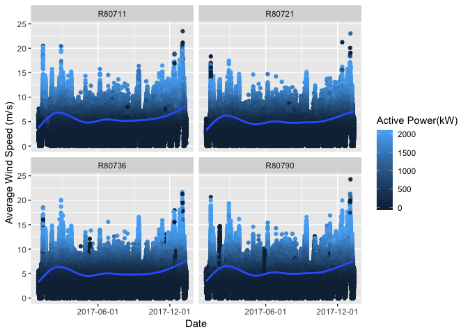
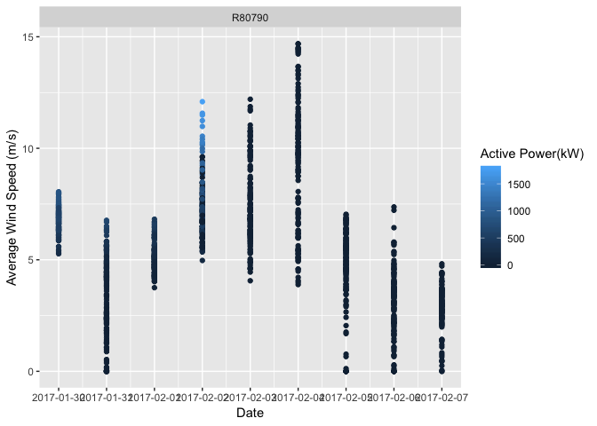

Milestone Data Story
================
Max Davis
9/29/2019

The Problem
-----------

The problem I will use this data to address: Is it possible to predict when a turbine will not produce power, when we would otherwise expect it to be producing. Wind turbines producing less than optimally is a natural problem for a wind farm, and insights about this problem may be gained from large sets of data from multiple wind turbines.

The Data
--------

This dataset contains approximately one year of sensor readings for four individual wind turbines on the Haute-borne Wind Farm in France. Separate observations are listed for a given sensor's minimum, maximum, and average reading. Included in the observations is "Active Power", which in terms of electrical generators, is a measurement of how much power a turbine is producing. This will be the key reading to determine power. As I will demonstrate, the overwhelming trend of this data is that Wind Speed and Active Power, are highly positively correlated, but there are interesting exceptions.

A wind farm is not a closed system but rather connected to a grid with fluctuations in demand, and other factors. The technicalities of this relationship are beyond the scope of this project and my own knowledge of the field. So I will focus on the dataset at hand, knowing the results will not be definitive.

To clean the data for a better analysis I have taken steps to rename all of the variables which were only names with a non-descriptive one or two-letter name and then either a "min", "max" or "avg" appended to it. The two letter names stand for a sensor reading such as "Nu" for "Apparent\_power", and so on. The full description of each variable was found in a file that could be downloaded along with the data.

To begin exploring the relationship between wind speed and active power, I plotted wind speed against Active Power on the y-axis, which did indeed show a positive relationship, albeit with some interesting anomalies. To better understand the anomalies, I examined the individual wind turbine side by side. Two of the turbines had a more pronounced deviation from the main trend of the data. This was in the form of a steeply positive sloping branch to the left of the main branch.

To keep the same basic visualization and try to learn what made those areas different, I started mapping different variables to color, and found that by mapping date to color, it was apparent that the break away groupings in each of the turbines mostly seem to be in the chronologically earlier part of the sample, appearing as dark blue spikes to the left of the main grouping (where dark blue corresponds to earlier dates).

Could it be the turbines ran more efficiently sooner after installation? However, the very highest points of efficiency (where there is wind speed around 5 m/s, and high active power) are later in the time series, or lighter in color. This plot also raised another question: why might turbine R80711 have a significantly larger range of active power readings at the higher wind speeds? Above ~12.5 m/s, the correlation between wind speed and active power becomes much weaker for that turbine.

To get a different perspective, I tried comparing wind speeds over time, and how the active power is affected. For a new set of plots, I mapped the date on the X-axis, and wind speed on the Y-axis, and this time mapped Active Power to color. Over a full year period, the resulting plot showed that wind rise and fall over time is cyclical, with a generally corresponding increase and decrease of Active Power as observed in the previous plots. But in this plot, some dark spikes indicate low to zero active power at high wind speeds: 

As an experiment, I isolated the darkest spike in Turbine R80790’s time series. Since this dark spike represents an unexpected lack of Active Power at high wind speeds for a given amount of time, I filtered out a smaller date range on either side of the dark spike (9 days) and changed the date label to 1 day instead of 6 months to see exactly which days are in question.

The resulting plot revealed that the dark spike occured over just a two day period, February 3rd and 4th of 2017, when despite the windy conditions, and the three other turbines producing power, Turbine R80790 was not producing. Further exploration might determine whether it was down for service (would require access to service records), or perhaps we can read into the data to figure out if something else created a fault and if there might have been a predictor for that fault in the preceding time periods.

The Approach
------------

This has suggested to me some parameters for a machine learning approach. I will create a new classifier, one that marks whether the turbine is below an Active Power level of 50kW while Wind Speed is over the functional level of 5 m/s. I will call this binary classifier "down", a "1" indicating that the conditions are met, and a "0" that they are not, and the turbine is performing as expected. It was not until exploring the data and visualizing the spikes in wind without corresponding spikes in power that this approach occurred to me. If machine learning is effective in predicting cases of the classifier being positive, I might be able to offer a client suggestions for anticipating down turbines and proactively responding to them.
