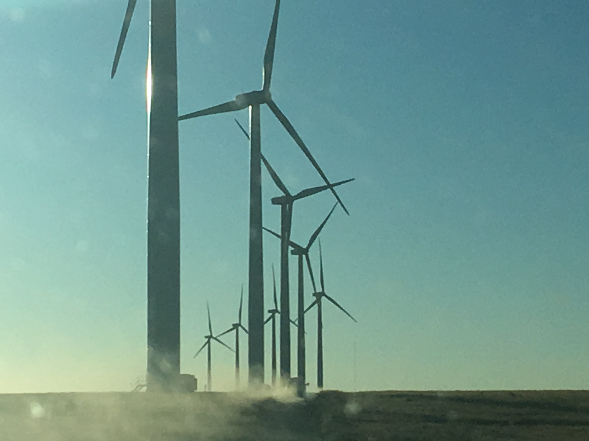

## Model of Wind Turbine Production. 
Capstone Project Proposal

Max Davis

  
  
This project analyzes data from the Haute Borne wind farm in France. It contains readings from sensors on four wind turbines from 2017 to 2020. 
<https://opendata-renewables.engie.com/explore/dataset/la-haute-borne-data-2017-2020/export/> This data may be good for machine learning as it has 217,588 observations of 138 variables. 

In this github repository, the "Haute Borne Markdown" is a file that cleans the data.

__1. What is the problem you want to solve?__

  The overall goal is to understand what variables determine the power output of wind turbines, so we have a model that shows, based on past data, what we might expect power ouput to be, given some other variables. If possible, I would like to also predict when a turbine will fault.
  
__2. Who is your client and why do they care about this problem? In other words, what will your client DO or DECIDE based on your analysis that they wouldn’t have otherwise?__

  This analysis would be useful for owners of the smae model of wind turbine in other areas, or those looking to acquire wind assets and determine the suitability of this model to the conditions in a given location.

__3. What data are you going to use for this? How will you acquire this data?__

  The Haute Borne Wind Farm data is available for free through ENGIE open data. It can be downloaded in smaller pieces, but I will work with the entire set, that is 4 turbines over 4 years.

__4. In brief, outline your approach to solving this problem (knowing that this might change later).__

  I will compare vriables and their relationship to power output, and try to predict outputs based on the large amount of data available. First I will clean the data, making the names of variables more descriptive. Cleaning will also involve deciding what to do with NA values, and how to make sure each variable has the structure that makes the most sense, converting strings to continuous and so forth.
  An exploratory data analysis will produce some visualizations and hopefully reveal some relationships in the data that will lead to deeper investigation. I anticipate that looking at power output will be easier to measure than when a turbine has faulted, so I will need to do some research to better undertand how to determine when a turbine is down from a fault from these observations. 

__5. What are your deliverables? Typically, this would include code, along with a paper and/or a slide deck.__

  I will have all the code for cleaning the data, which a potential client could apply to new data, as well as plots demonstrating the complex series of relationships between variables in a step-by-step, readable fashion. The report included with the code and visualizations will offer suggestions about which observations are most predictive of power output, or turbine failure, and suggestions for further analysis of the data.

