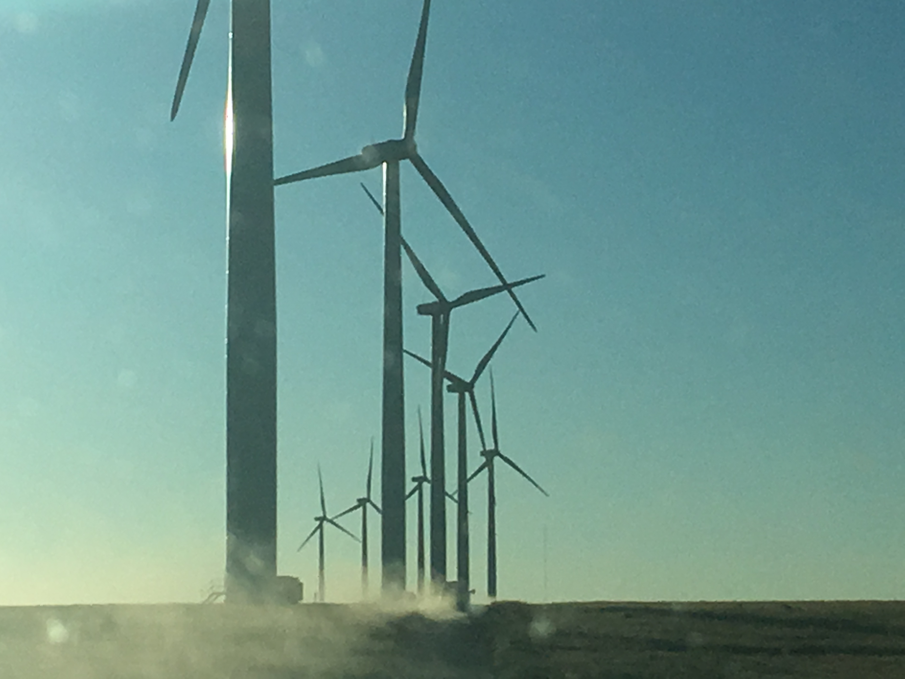

```{r, include = FALSE}

all_turbines <- readr::read_csv("uswtdb_v2_0_20190417.csv")

```
## Anticipating the Wind Turbine of the future. 




  
  
  This project will look at The U.S. Wind Turbine Database. The data locates all wind turbines in the United States from the U.S. Geological Survey and offers information about a number of variables, including make, power generation capacity, and year built. The dataset can be found at <https://eerscmap.usgs.gov/uswtdb/>

1. What is the problem you want to solve?

  The overall goal is to understand changes in the wind industry. What types (capacity) of Turbines different manufacturers have built, in what geographic areas are we likely to see growth?
  
2. Who is your client and why do they care about this problem? In other words, what will your client DO or DECIDE based on your analysis that they wouldn’t have otherwise?

  This analysis will be useful for power companies expanding into wind energy, states and governments determining policy around wind energy. Investors buying wind energy assets.

3. What data are you going to use for this? How will you acquire this data?

  The U.S. Wind Turbine Database is available for free through the American Wind Energy Association.

4. In brief, outline your approach to solving this problem (knowing that this might change later).

  I will compare various manufacturers on several variables over time.

5. What are your deliverables? Typically, this would include code, along with a paper and/or a slide deck.

  Slides with plots comparing manufacturers' growth in total capacity, geographic areas covered. Offer suggestions in a paper about where wind farm development is likely to occur in the future, what type of turbine the industry is finding to be most effective (larger versus smaller), and which manufacturers will be leaders. Some package of code tailored to this dataset for making comparisons.

## An Example of a Plot using this data


```{r all_turbines, echo=FALSE}
plot(all_turbines[["p_year"]], all_turbines[["t_cap"]], 
     main = "Turbine Capacity Over Time",
     xlab = "Year Built",
     ylab = "Turbine Capacity (kW)",
    pch = 20,
    col = "darkgreen"
    )
```


  As the plot shows, as more turbines have been built over time, the range of capacities has expanded.

